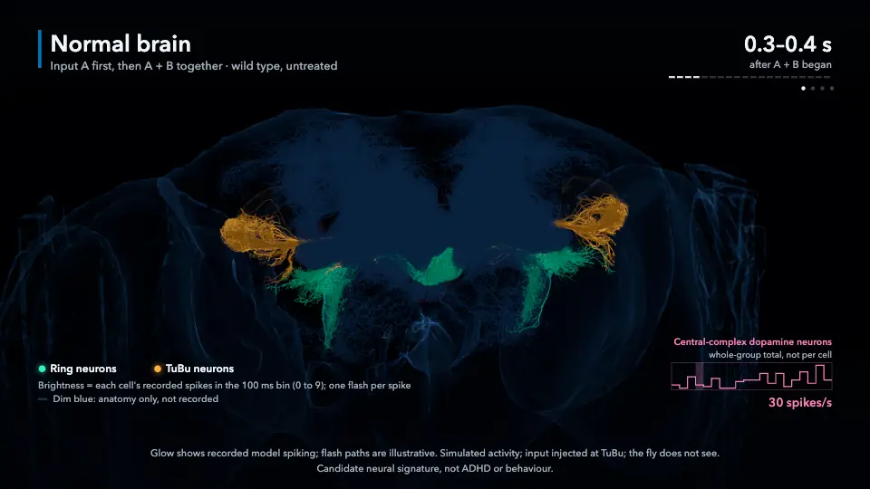

# flyonenomics

[Read the preprint](https://doi.org/10.5281/zenodo.23091460) · [Code archive (v1.0.0)](https://doi.org/10.5281/zenodo.23070186)

This undergraduate, AI-assisted project uses a wiring map of the male fly's
brain and nerve cord to simulate nerve-cell activity. Can this virtual nervous
system help ask pharmacology questions without mistaking model output for a
living fly's behaviour? We change dopamine cleanup and the strength of chemical
connections, then look at activity across the network. Input is injected into
the model, not seen by the fly. In the dopamine study, patterned input is injected
at TuBu (tubercle-to-bulb) neurons; **the fly does not see**. The *fumin*
fly mutant is hyperactive; here we model transporter loss, not behaviour or ADHD.

[](figures/3d/experiment-5b/cinematic/primary-demo.mp4)

*Short loop from an illustrative simulation, not the statistical test. Glow tracks
recorded model spiking; flash timing within each bin is illustrative. Input is
injected at TuBu; the fly does not see. [Film (83 s)](figures/3d/experiment-5b/cinematic/primary-demo.mp4)
· [poster](figures/3d/experiment-5b/cinematic/primary-poster.png)
· [figure methods](docs/3d-model.md).*

[MaleCNS anatomy atlas](figures/3d/male-cns-atlas.png):

*Real MaleCNS anatomy, simplified and recoloured—not simulated activity.*
Open [`figures/3d/male-cns-atlas.html`](figures/3d/male-cns-atlas.html) locally
in a browser to rotate it. Its default playback is explicitly **synthetic dummy
data**. [Figure methods and attribution →](docs/3d-model.md)

[Reproduce the results](REPRODUCE.md) · [Read the paper](paper/) ·
[Citation details](CITATION.cff) · [MIT code licence](LICENSE)
(source data: CC BY 4.0) ·
[Feedback via issues](https://github.com/uguryildirim24/flyonenomics/issues).

## The model and the evidence

The current dataset is **MaleCNS v1.0**, from **Janelia Research Campus, Google
Research and the University of Cambridge**, released under
[CC BY 4.0](https://creativecommons.org/licenses/by/4.0/).
The model retains **162,517 typed, traced neurons and 25,120,209 directed
connections** from the male central nervous system, including the nerve cord;
it is not every cell in the release. Neurons are simplified leaky
integrate-and-fire units, with declared dopamine/receptor assumptions.
[Build rules and limitations →](docs/malecns-port.md)
[Provenance erratum for frozen parameters and engine notes →](docs/errata.md)

The project began with [Shiu et al.'s 2024 model](https://github.com/philshiu/Drosophila_brain_model)
of the **female FlyWire connectome** (v630/v783). Those experiments remain as
history, not evidence about the male model.

Available now:
- [Male resting-state measurements](docs/malecns-rest.md): ten seeds, a fixed
  configuration, and per-seed results—not biological pass/fail thresholds.
- [Literature and implementation audit](docs/adhd-model-research.md): what
  dopamine-transporter loss (*fumin*) and reduced release can honestly test.
- [Reproduction commands, hashes and costs](REPRODUCE.md).

## Results

- **Dopamine cleanup.** We tested whether disabling the dopamine transporter
  changes a nerve-cell response depending on earlier input. The first study's
  hint did not survive its correction for two planned comparisons; reducing
  dopamine release gave **no detected difference** in the gap between conditions
  and no established rescue. A separately planned follow-up found **no detected
  difference** in the cleanup comparison. An interval spanning zero leaves both
  directions possible; it does not show equality. These are repeated random runs
  of one model, not different animals. [First study](docs/adhd-study-results.md) ·
  [follow-up](docs/adhd-confirm-results.md).
- **Chemical knockout tour.** Disconnecting the model's acetylcholine outputs
  reduced firing outside sensory cells. Disconnecting GABA or glutamate outputs
  raised it. Histamine and dopamine readouts had no detected difference in the
  measured averages. These broad switches test the model's wiring, not drug
  effects in live flies. [Tour results](docs/circuit-tour-results.md).
- **Courtship pathway.** Directly injected input into P1 courtship neurons
  reached some song-related and wing motor neurons. The proposed split between
  fighting and song routes was not demonstrated; spikes are not courtship or
  sound. [Pathway results](docs/circuit-tour-results.md).
- **GABA dose and rescue.** GABA is an inhibitory connection class: weakening
  it lets more activity through. Firing rose slowly at low block and sharply
  near full block. Strengthening a separate inhibitory channel, GluCl, partly
  offset the excess under partial GABA block. The block levels are fractions
  of the model's GABA connection strength switched off, not drug doses given
  to a fly. [Dose results](docs/gaba-dose-results.md).
- **Virtual body.** Recorded spikes drive chosen wing and leg movements in
  animations. The body sends nothing back to the brain; the clips show a
  display rule, not observed behaviour. [Courtship playback](docs/courtship-body.md) ·
  [dose playback](docs/gaba-dose-body.md).
- **GPU replication.** A second computing engine matched the reference engine's
  spikes for the tested identical inputs with fixed dopamine. On a separate
  GABA dose run, the main block and rescue estimates had overlapping intervals;
  some smaller results and curve fits differed. Computational agreement does
  not validate the biology. [Engine methods](docs/cuda-methods.md) ·
  [dose replication](docs/gaba-dose-gpu.md).


*Model activity in one illustrative seed, not the statistical test. Input is
injected at TuBu; the fly does not see. [Recorded film](figures/3d/experiment-5b/cinematic/primary-demo.mp4)
· [offline cinematic viewer](figures/3d/experiment-5b/cinematic/male-cns-cinematic.html)
· [figure methods](docs/3d-model.md).*

[Paper and PDF build](paper/) (`uv run --locked --script paper/build.py`)
· [reproduction commands](REPRODUCE.md).

## Install and reproduce

With [uv](https://docs.astral.sh/uv/), Git, Python 3.12 and a C/C++ toolchain:

```sh
git clone https://github.com/uguryildirim24/flyonenomics.git
cd flyonenomics
uv sync --frozen
```

Viewing the committed figure needs no Python or data download. Rebuilding it
needs Chrome and about **165 MB** of source assets. Numerical work needs large
cached tables: the complete male flat-data inventory is **24.38 GB**, plus
space for derived arrays. The recorded 701-brain-second rest measurement took
**2 h 24 min** on a 16-core ARM Linux machine with about 94 GiB RAM, using eight
workers (summed worker peak memory about 58 GB). These are measurements, not a
laptop runtime promise. See [REPRODUCE.md](REPRODUCE.md) before starting a run.

## Citation, credits and licences

Preprint: **Hasan "Rolf" Yildirim** (2026). *A whole-nervous-system model of the male fly as a pharmacology bench*. Zenodo. [doi:10.5281/zenodo.23091460](https://doi.org/10.5281/zenodo.23091460).

Code: **Hasan "Rolf" Yildirim** (2026). *flyonenomics* (v1.0.0). Zenodo. [doi:10.5281/zenodo.23070186](https://doi.org/10.5281/zenodo.23070186).
See [CITATION.cff](CITATION.cff) and the [paper folder](paper/) for citation
details. Cite the MaleCNS paper separately for the underlying connectome.

MaleCNS: Berg et al., *Sexual dimorphism in the complete Drosophila male central
nervous system connectome*, **Cell** (2026),
[doi:10.1016/j.cell.2026.08.015](https://doi.org/10.1016/j.cell.2026.08.015).
Source data and derived anatomy retain CC BY 4.0 attribution. The atlas embeds
Three.js's MIT notice; historical Shiu/FlyWire and other sources are catalogued
in [the data guide](docs/data.md) and [provenance](data/provenance.json).

Project code is [MIT licensed](LICENSE); third-party code and data licences
remain separate. This is an AI-assisted project; methods and scientific
provenance are linked from the [documentation map](docs/index.md).
