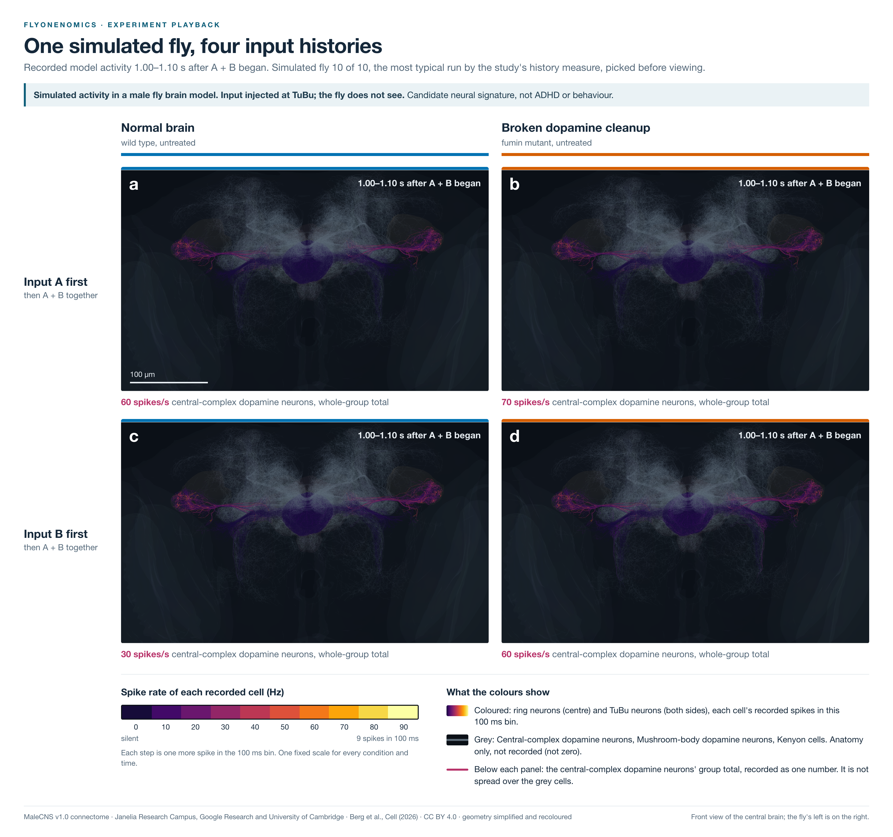

# flyonenomics

A connectome-based spiking model of the male fly nervous system for studying simulated dopamine and transmitter perturbations.

Rolf built this project to ask what a wiring-constrained model can show about
pharmacology, without treating simulated activity as animal behaviour. It uses
MaleCNS v1.0 anatomy and simplified leaky integrate-and-fire neurons. Input is
injected into the model. In the dopamine experiments it enters at TuBu neurons,
downstream of the eye. The fly does not see. Transporter loss is a model
manipulation, not a model of ADHD or a treatment recommendation.

[Preprint](https://doi.org/10.5281/zenodo.23091460) ·
[Code archive v1.0.0](https://doi.org/10.5281/zenodo.23070186) ·
[Reproduction guide](REPRODUCE.md) · [Documentation map](docs/index.md)

## What it shows

The retained graph contains **162,517 neurons and 25,120,209 directed connections**.
[Graph rules and limits](docs/malecns-port.md) describe which cells it excludes.

- **Dopamine: no significant primary result after correction.** The pilot
  genotype comparison had Holm-adjusted p = 0.0703125. Its release comparison
  had no detected difference or established rescue. The separately planned
  40-seed follow-up was unconfirmed (p about 0.9454). Intervals containing zero
  do not establish equality. These are random repeats of one model, not flies.
  [Pilot](docs/adhd-study-results.md), [follow-up](docs/adhd-confirm-results.md).
- **Transmitter switches and courtship input.** Acetylcholine disconnection
  suppressed activity; GABA and glutamate disconnection increased it. Direct
  P1 input reached some song-related and wing motor neurons. Spikes do not
  establish song, courtship or aggression. [Results](docs/circuit-tour-results.md).
- **GABA block and rescue.** Near-total GABA block sharply raised firing.
  Strengthening GluCl partly offset activity under partial block. The axis is
  a fraction of model connection strength, not a measured drug dose.
  [Results](docs/gaba-dose-results.md).
- **GPU comparison.** Identical saved inputs with clamped dopamine produced
  matching tested spike outputs in Brian2 and CUDA. Stochastic dose estimates
  differed in some details. This checks computation, not biology.
  [Methods](docs/cuda-methods.md), [dose comparison](docs/gaba-dose-gpu.md).



One illustrative seed, not the statistical test.
[Recorded film](figures/3d/experiment-5b/cinematic/primary-demo.mp4) and
[figure methods](docs/3d-model.md).

## Run from a clean clone

Install Git, Python 3.12 and [uv](https://docs.astral.sh/uv/). A C/C++ toolchain
is needed for Brian2 numerical work.

```sh
git clone https://github.com/uguryildirim24/flyonenomics.git
cd flyonenomics
uv sync --frozen
uv run --frozen python scripts/adhd_confirm_describe.py \
  --result validation/records/p2/adhd-confirm-results.json \
  --out .cache/confirmation-figures
```

The last command needs no downloaded data, browser, GPU or cloud account. It
writes `per-seed.svg` and `time-course.svg` to an ignored directory from the
committed follow-up result. It plots existing summaries; it does not rerun
inference or simulation.

Open `figures/3d/male-cns-atlas.html` locally for the canonical offline anatomy
viewer. Its default playback is **synthetic dummy data**, not recorded activity.
The other viewers and videos are retained offline assets. Full-resolution media
and dense evidence remain here until reviewed archives with stable hashes exist.
This makes the clone large. No external media archive is promised.

To build the draft paper, install Tectonic and Cairo as described in
[paper/README.md](paper/README.md), then run:

```sh
uv run --locked --script paper/build.py
```

PDFs go to ignored `paper/build/`. The build checks the bound summaries; it does
not certify numerical reproduction.

### Numerical work and data

Set `FLYONENOMICS_CACHE_DIR="$PWD/.cache"` for downloaded and derived tables.
[REPRODUCE.md](REPRODUCE.md#male-source-data-one-time-download-not-a-model-run)
provides the seven-table downloader and checksum checks. Source URLs, sizes and
hashes are in `data/malecns-v1.0-manifest.json`. The tables total about 24.38 GB.
The guide also identifies the required Shiu code checkout. Raw downloads, caches
and new runs stay out of Git; `data/` retains curated model inputs and manifests.
No cloud credentials are required for the public CPU path.

**This is not complete historical numerical replay from Git alone.** Original
pilot, follow-up and other raw run archives have not been publicly deposited.
Their executed private-source revisions are not public Git commits. The current
CPU worker path uses committed runtime tables after provisioning the cache.
Historical `malecns_substrate.py --regenerate` and `--probe` reject two changed
inputs, as they should. Do not replace their old pins with current hashes.
See [the reproduction boundary](REPRODUCE.md#public-snapshot-boundary) and
[the input-pin erratum](docs/errata.md#historical-substrate-input-pins).

The measured ten-seed rest run needed about 58 GB of summed worker peak memory
and 2 h 24 min on a 16-core ARM Linux machine with eight workers. That is not a
laptop runtime promise. GPU replay needs NVIDIA hardware and absent raw arrays.
Modal launchers are not shipped. Historical Camber CPU scripts remain, but
need paid compute, source caches and local account settings.

Camber account and team identifiers are redacted. Before using the retained
scripts, set their existing `STASH` and `ROOT_STASH` variables to Rolf's own
Stash paths. `stage.sh` uses `STASH`; submission scripts use `ROOT_STASH`.
The `CAMBER` variable can point to the installed CLI. No credentials are shipped.
These scripts are not part of the data-free run above.

## Layout

| Path | Contents |
|---|---|
| `src/flyonenomics/` | Engines, registry, dopamine model, orchestration, analysis and local interfaces |
| `scripts/` | CPU experiment runners, analysis and figure tools |
| `data/` | Curated configurations, selectors, source manifests and attribution |
| `validation/records/` | Recorded summaries, plans, checksums and computational checks |
| `figures/`, `docs/figures/` | Committed figures and offline playback assets |
| `paper/` | Manuscript, supplement, result bindings and build scripts |
| `docs/` | Methods, results, data guide and scientific errata |
| `tests/` | Existing component tests and intentional stored-run fixtures |

## Limits and known gaps

One anatomical specimen, shared electrical constants and assumed receptor
densities limit biological interpretation. There are no electrical synapses or
learning. The body animation is one-way playback, with no feedback to the brain.
The eye-to-brain path is not validated. Tests of numerical agreement are not
animal experiments. Missing raw archives and historical inputs limit replay.
[The paper](paper/manuscript.tex) and [errata](docs/errata.md) state these limits.
Public tests include dataset-dependent checks; they are not an installation
check. Historical private-suite gate counts are not public-suite results.
Historical Phase 1 calibration, behaviour validation and ring-stage tools remain.
Their required private behaviour input and some rest receipts are not shipped.
Those paths are not complete clean-clone run instructions. The existing checks
and input bindings are unchanged. No replacement evidence is supplied.
See [public checks and historical gates](REPRODUCE.md#public-checks-and-historical-gates).

## How this was built

AI coding agents did much of the implementation, analysis tooling and drafting
under Rolf's direction. Rolf chose the research question, directed the dataset
move and accepted the declared starting configuration. He is responsible for
the scientific scope and release approval. Source checking and computational
review by agents are recorded separately; they are not independent human
replication. No claim is made that Rolf manually reviewed every generated line.
See [Author contributions and AI use](paper/manuscript.tex#L124).

## Citation and licence

Hasan "Rolf" Yildirim (2026). *A whole-nervous-system model of the male fly as a
pharmacology bench*. Zenodo preprint, not peer reviewed.
[doi:10.5281/zenodo.23091460](https://doi.org/10.5281/zenodo.23091460).
[CITATION.cff](CITATION.cff) includes the code archive and citation details.
The archive release is v1.0.0; the Python distribution metadata remains 0.1.0.
These are separate identifiers, not a claim that all historical runs used the
current package snapshot.

Project code is [MIT licensed](LICENSE). MaleCNS source data and derived anatomy
retain CC BY 4.0 attribution. Cite Berg et al., *Sexual dimorphism in the complete
Drosophila male central nervous system connectome*, Cell (2026),
[doi:10.1016/j.cell.2026.08.015](https://doi.org/10.1016/j.cell.2026.08.015),
separately for the connectome. [NOTICE](NOTICE), [the data guide](docs/data.md)
and [provenance](data/provenance.json) cover third-party licences.
