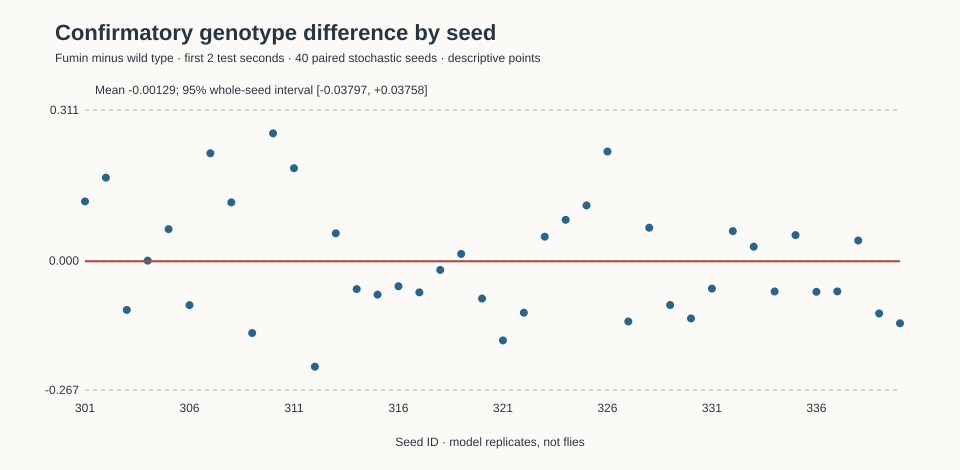
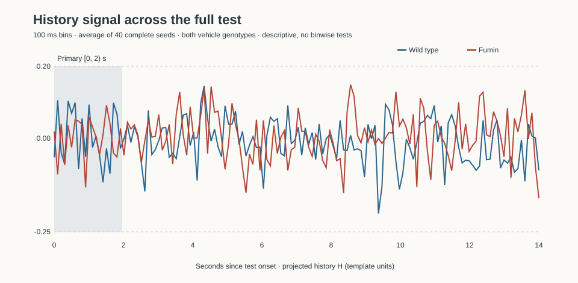

# Forty-seed genotype follow-up — confirmatory result

**Not confirmed under the frozen negative-estimate / two-sided p < 0.05 rule.** ΔH_gen = **−0.001286** template units; 95% whole-seed bootstrap interval **[−0.037968, +0.037578]**, Monte Carlo paired sign-randomisation **p = 0.945398** (945,398 extreme draws of 1,000,000; `(k+1)/(M+1)`). The interval includes zero: **no detected difference**, not evidence that the genotypes are the same. The rule was committed before any 301–340 outcome; no additional primary or Holm correction was used.

Input was **injected at TuBu; the fly does not see**. These are 40 stochastic seed replicates of one fixed MaleCNS neural model, **not 40 animals**. The claim ceiling remains a candidate neural signature in that fixed model under a dopamine-uptake perturbation—not ADHD, attention, behaviour or a vision experiment.

## Design and inference

The pre-run [frozen design](adhd-confirm-design.md), [full plan](../validation/records/p2/adhd-confirm-plan.json) and the follow-up design (now SPEC-P2 item 160 after integration) were bound in commit `5d410c7ef006fceac890f5fbed3105456945bf9b`, before this outcome. Seeds 301–340 were fresh relative to checked study/calibration/rest/test records. Each seed contributed eight arms: `wt-vehicle` and `fumin-vehicle` × `(A,off), (A,AB), (B,off), (B,AB)`. The blank-prefix arms and release-reduction conditions from the pilot do not enter this H contrast and were deliberately omitted, leaving 320 arms. The male substrate (`rest:ed9b0a469d7a6b77`), explicit arrays, 245 TuBu-reached ER cells, d-0025 paired input, original −50°/+50° 5a-01 axis and all model/condition constants were unchanged. `CX_DAN` was undriven. Settle/prefix/gap/test were 2/5/1/14 s; the primary ER rate is from test [0,2) s (trial [8,10) s).

Per seed and genotype, H projects `(A→AB − A→off) − (B→AB − B→off)` onto the **independent 5a axis**. The sole primary is `H(fumin, vehicle) − H(wild type, vehicle)`. The 10,000 whole-seed percentile bootstrap resamples all paired follow-up arms and independently refits the axis over resampled original calibration seeds, pair held fixed; **zero invalid fits**. It propagates template uncertainty, not pair-selection uncertainty. The two-sided test randomised paired signs for 1,000,000 fixed-seed Monte Carlo draws, conditional on the fitted axis; its fixed seed is 14620260926 (bootstrap 14620260925). This is an estimate of the sign-randomisation tail, not an exact enumeration over 2⁴⁰. The synthetic n=10 path was checked against exact enumeration before launch. Alpha was 0.05 and direction negative, not chosen from this result. No interim looks, seed substitutions, arm omissions or audit relaxations occurred.

The 40 paired differences contain 21 negative and 19 positive values; observed range **[−0.21894998, +0.26299745]** template units. These are seed observations, not 40 independent neurons or a new sign test. The pilot's 10-seed genotype estimate was **−0.085156** (Holm p 0.0703 over two pilot primaries); it motivated but did not contribute to this primary. The **50-seed pilot-plus-confirmation mean is −0.018060** template units, a secondary pooled summary only, **not a replacement decision**; the pilot is selection-biased by the reason for follow-up. Secondary paired t = **−0.069076**, two-sided p = **0.945282**; paired Cohen d = **−0.010922**. No inference is attached to the pooled estimate, t result or descriptive curves.

### Descriptive group means and test time course

| Vehicle condition | Mean H | Observed seed range |
|---|---:|---:|
| Wild type | +0.002396 | [−0.186407, +0.163878] |
| Fumin | +0.001110 | [−0.150964, +0.197228] |

The four prefix-group means are pair-minus-off projections before A-minus-B subtraction (observed seed ranges, **not confidence intervals**):

| Vehicle condition / prefix | Mean | Observed seed range |
|---|---:|---:|
| Wild type / A | −0.317447 | [−0.493330, −0.143826] |
| Wild type / B | −0.319842 | [−0.459011, −0.171497] |
| Fumin / A | −0.323310 | [−0.511785, −0.124255] |
| Fumin / B | −0.324420 | [−0.471518, −0.185356] |

The time course plots mean H over complete seeds for the full 14 s test, in **100 ms bins**. Outside the shaded first 2 s it is descriptive, not a second response-window decision. The frozen affine secondary was dropped: its 5b fit had tiny positive corrected variances and exploded numerically under its own fixed rule; no replacement affine analysis or mechanism claim was made.

## Exact audits, transfer and qualification

The full run completed on `compute host` (`<compute-home>/flyonenomics-t-0095/camber-runs/adhd-confirm/full`), **2026-09-24 16:51:16 to 2026-09-25 14:00:32 UTC**, exit **0**, **12 workers**, 21 h 9 min 16 s wall. All **40 complete seed manifests, 320 NPZs and 320 per-arm journals** were present (680 files, 220,015,099 bytes). The frozen box `audit-confirm` checked every file's SHA-256 against its manifest/journal and the plan/pair/arm ordering and male-array binding; within each seed all eight arms had exactly one identical initial engine-RNG next-draw hash and one identical final hash. The *actual complete injected arrays* matched their pre-generated list hashes and each identical final stimulus had **identical final event arrays** across histories and genotypes. Every primary response window was [8,10) s; separate checks matched **ER and TuBu response rates exactly** to the recorded counts divided by 2 for all 320 arms. No mismatches were seen. The 40-seed audit succeeded **before** analysis touched primary rates. An intact copy of all raw files and box receipts was transferred home to this worktree's ignored `camber-runs/adhd-confirm/`; an independent local SHA-256 check matched **all 680/680** against the remote audit receipt and verified that no extra file was present.

The frozen `analyse-confirm` ran unchanged on the box after the home hash verification against the original complete 5a-01 and audited 5b-02 raw files, with Python 3.12.14, NumPy 2.5.3, SciPy 1.16.2, Brian2 2.10.1. Its own checks revalidated all 40 raw runs plus 5a and pilot raw receipts. No model, runner, inference rule or timing was changed after the design freeze. Before launch, the short two-seed male diagnostic passed exact audits and the lane's isolated pinned full gate passed **964 passed, 30 skipped**, exit 0 (5,245 s). A new gate was **not** launched after results: the r60 review gate was already active on the shared box.

Records and one-command reproduction:

- [Frozen plan](../validation/records/p2/adhd-confirm-plan.json) (SHA-256 `661823052bcb02ec96e2a04ca0d08e5587bc7ef0ddfaf49dbb00de54c7867e00`), [reviewed calibration pair](../validation/records/p2/adhd-study-pair.json).
- [Unchanged numerical result](../validation/records/p2/adhd-confirm-results.json) (SHA-256 `2b923d25bd24ff2799eff013e596dd7c168e14c91faa126a5c9163e877202b78`), including 40 seed differences, all 100 ms series and pilot binding. [Exact remote audit receipt](../validation/records/p2/adhd-confirm-audit.json) (SHA-256 `d8291803b9d88c4c7f7625ee53116785e73aac4e4cdc9e97f526d2cb8d10a006`) lists all 680 per-file hashes; [execution and transfer record](../validation/records/p2/adhd-confirm-execution.json) binds environment, dates, commands and plot hashes.
- From the box worktree (with `FLYONENOMICS_CACHE_DIR=<compute-home>/flyo-cache`): `.venv/bin/python scripts/adhd_study.py audit-confirm --plan validation/records/p2/adhd-confirm-plan.json --pair validation/records/p2/adhd-study-pair.json --raw camber-runs/adhd-confirm/full --out camber-runs/adhd-confirm/audit-box.json`; then `.venv/bin/python scripts/adhd_study.py analyse-confirm --plan validation/records/p2/adhd-confirm-plan.json --pair validation/records/p2/adhd-study-pair.json --raw camber-runs/adhd-confirm/full --calibration <compute-run-root>/camber-runs/adhd-study/5a-01 --pilot <compute-run-root>/camber-runs/adhd-study/5b-02 --out camber-runs/adhd-confirm/results-box.json`.
- Regenerate purely descriptive SVGs with `python3 scripts/adhd_confirm_describe.py --result validation/records/p2/adhd-confirm-results.json --out docs/figures/adhd-confirm`.
