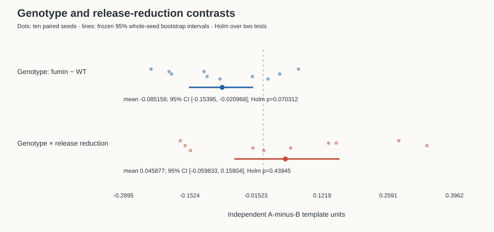
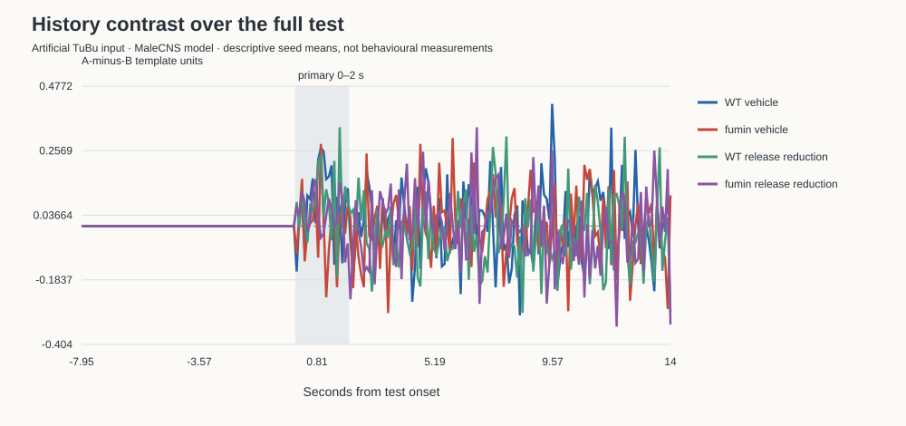

# Male dopamine/history experiment — reviewed first results

**Status:** First-study results reviewed; independent recomputation matched the recorded analysis.

**First-study numbers, in independent A-minus-B template units:** ΔH_gen = **−0.085156**, 95% bootstrap interval **[−0.153954, −0.020968]**, exact paired sign-randomisation p = **0.03515625**, Holm p = **0.0703125**: nominal interval excludes zero, but **not Holm significant**. ΔΔH = **+0.045877**, interval **[−0.059833, +0.158040]**, exact/Holm p = **0.439453125**: **no detected difference**, not Holm significant. Neither primary survives the frozen two-test Holm procedure at 0.05.

Input was **injected at TuBu; the fly does not see**. These are stochastic repetitions of one fixed male neural model, not animals. At most, the descriptive pattern is a **candidate neural signature** under the modelled perturbation—not ADHD, attention, behaviour, therapeutic rescue or a drug dose.

## What was analysed

- **5b-02 only:** seeds 201–210, four conditions × eight protocols × ten seeds = **320 arms** and **ten complete, audited seed manifests**. All 60 partial 5b-01 arms remain **void and excluded**.
- Fixed male substrate **`rest:ed9b0a469d7a6b77`**, explicit male arrays: **162,517 neurons, 25,120,209 edges**. All **245 anatomy-selected ER cells** retained; 156 injected TuBu source cells. No generic FlyWire defaults substituted.
- Frozen **−50°/+50°** pair (A/B), committed at `e34ca13`, with templates from all ten original **5a-01** seeds. Pair selected by the first-eligible anatomical order, not maximum distance; basis condition number **1.352292**. Calibration four-way held-seed ER and TuBu decoder accuracies were **1.00**. Both four-/five-way confusion matrices and every candidate margin remain in the [unchanged pair record](../validation/records/p2/adhd-study-pair.json).
- **5a used pre-d-0025 input plumbing with the same per-cell clocked-Poisson input statistics and per-arm model law.** d-0025 retained it and its pair. Its old RNG audit remains failed; immutable post-hoc selection-only receipts are not original runtime certificates. Replays 101/102 proved exact old-output byte reproducibility, not audit success. Replay 103–110 was skipped by the coordinator. No calibration/pair reselection occurred.
- Every 5b trial: **2 s settle, 5 s prefix, 1 s blank gap, 14 s test**; primary response **first 2 test seconds**, absolute [8,10) s. No within-trial restore/reseed. Release fraction **0.37499999999999994**, fixed from chemistry before outcomes, applied to both genotypes; fumin removes transporter uptake but retains non-transporter clearance.

## Frozen inference, unchanged

`adhd_analysis.py` was not edited. H is the difference between the A-prefix pair-minus-off response and the B-prefix pair-minus-off response, projected onto the independent calibration axis. One calibration A-minus-B difference is one template unit; neither sign is inherently healthy or impaired.

The **10,000 whole-seed percentile bootstrap** resamples all conditions/protocols together and independently resamples calibration seeds/refits the axis, holding the selected pair fixed. **Zero undefined resamples** occurred. This propagates template uncertainty, **not pair-selection uncertainty**. Exact two-sided paired sign randomisation enumerates **1,024 assignments**, conditional on the fitted axis and sign-exchangeability. Holm covers **exactly the two primaries**. The bootstrap intervals are nominal 95% intervals, not simultaneous Holm intervals; hence the genotype interval excluding zero does not override the Holm decision.

### All four conditions

| Condition | Mean primary H | Observed ten-seed range |
|---|---:|---:|
| WT vehicle | +0.081309 | [−0.060360, +0.168759] |
| fumin vehicle | −0.003847 | [−0.176703, +0.143085] |
| WT release reduction | +0.079897 | [−0.007683, +0.180565] |
| fumin release reduction | +0.040618 | [−0.074635, +0.141374] |

These ranges are **descriptive seed ranges, not confidence intervals or additional tests**. Full-precision seed values and both paired contrasts are in [the per-seed CSV](../validation/records/p2/adhd-study-per-seed.csv).

The point-estimate genotype gap changes from **−0.085156** under vehicle to **−0.039279** under release reduction: smaller absolute magnitude, same sign, no point-estimate overshoot. WT's mean H moves **−0.001412**; fumin's moves **+0.044465**. Those arithmetic movements do **not** establish rescue: the interaction interval includes zero, and matched starting pools were an encoded assumption, not evidence of neural recovery or equilibrium.

## Key secondary: affine residual — retained, but unstable

The frozen cross-fitted per-cell nonnegative scale-plus-offset control gives residual mean **−1.576518 × 10¹²** template units, nominal 95% bootstrap interval **[−4.675593 × 10¹³, +1.814819 × 10¹³]**: **no detected difference**. No additional p-value or multiplicity claim was added for this secondary.

**This enormous estimate/interval is numerically uninformative, not a plausible neural effect size.** The frozen errors-in-variables moment correction yields tiny *positive* predictor variances (minimum **3.6140 × 10⁻²⁰ Hz²**) and fitted scales as large as **6.4051 × 10¹⁶**. The rule uses an intercept-only fit only for variance ≤0; **115–121 of 245 cells per fold** take that unresolved route. Tiny positive values are not clamped by the frozen rule, so some other slopes explode. Foldwise variances, covariances, scales, offsets and cell identities are retained in [the secondary record](../validation/records/p2/adhd-study-secondaries.json).

No tolerance, cap, exclusion, alternative fit or refitting rule was introduced after seeing this. All computed results remain finite and all 10,000 bootstrap resamples were retained. This secondary **cannot rule out an affine gain/offset explanation or establish non-affine history specificity**. The existing sparse-control/affine-null caveat remains: the synthetic affine-only null had a nominal nonzero secondary interval in one noisy fixture; it was not tuned away.

## Other frozen descriptive readouts

No new hypothesis tests, response windows or cell selection were added. All protocol/cell values, J vectors, mixture residual vectors and per-seed responses remain in the result/raw records. The following are summaries; ranges below again mean observed seed ranges, not CIs.

### Whole test and nonlinear mixture

| Condition | Mean H over all 14 test seconds | Seed range | Mean projected J |
|---|---:|---:|---:|
| WT vehicle | +0.018517 | [−0.028707, +0.066760] | −0.089906 |
| fumin vehicle | +0.000861 | [−0.060884, +0.105419] | +0.017916 |
| WT release reduction | −0.013845 | [−0.049304, +0.044764] | −0.038171 |
| fumin release reduction | −0.002916 | [−0.049327, +0.024406] | −0.032614 |

Here J is blank-prefix `AB − A − B + off`; its projected seed ranges are respectively **[−0.252348,+0.255412]**, **[−0.191948,+0.217793]**, **[−0.302645,+0.185544]**, **[−0.346114,+0.306711]**. Whole-test H is descriptive, not a substitute primary window.

For blank-prefix AB, mean unrestricted `(A coefficient, B coefficient)` and residual-vector norm are:

| Condition | A coefficient | B coefficient | Residual norm (Hz) |
|---|---:|---:|---:|
| WT vehicle | 1.091870 | 1.115421 | 12.944927 |
| fumin vehicle | 1.075337 | 1.064171 | 14.880881 |
| WT release reduction | 1.215579 | 1.151770 | 14.788497 |
| fumin release reduction | 1.177280 | 1.146833 | 15.514966 |

These are **not sum-to-one mixture weights**; neither a coefficient nor J alone demonstrates inhibition or competition. All seed ranges and all eight protocols are retained in the secondary record.

The 100 ms curves, four per-condition seed plots (`history-seeds-0.svg` through `-3.svg`) and four unsubtracted pair/off response plots (`raw-history-0.svg` through `-3.svg`) are in [the figure directory](figures/adhd-study/). They do not add temporal significance tests.

### Input audit and emitted activity

The frozen injected-rate totals are **926.888314 Hz** each for A and B, **1853.776627 Hz** for AB. Cap loss is **5.33 × 10⁻¹⁵ Hz** (roundoff scale); the pair is not identical to either member. Mean injected events in the primary 2 s are **1864.7 / 1864.7 / 3701.7** for A/B/AB; over the full 14 s, **13045.8 / 13011.4 / 25972.8**. Within each seed, these external events match **exactly** across matching final stimuli, conditions and histories.

Actual **emitted TuBu spikes** need not match: they are neural outputs, not injected events. Mean counts in the primary window for blank-prefix A/B/AB are:

| Condition | A | B | AB |
|---|---:|---:|---:|
| WT vehicle | 1644.0 | 1647.4 | 3252.0 |
| fumin vehicle | 1642.8 | 1649.0 | 3248.6 |
| WT release reduction | 1643.6 | 1646.9 | 3248.7 |
| fumin release reduction | 1643.4 | 1648.7 | 3245.5 |

All seed counts, all protocols and both windows are in the secondary record. For blank-prefix AB, mean primary-window firing rates (Hz per census neuron) are:

| Condition | ER (245) | TuBu (156) | DAN union (367) | CX_DAN (27) | Central (39,533) |
|---|---:|---:|---:|---:|---:|
| WT vehicle | 0.971837 | 10.423077 | 1.443597 | 1.946296 | 4.830777 |
| fumin vehicle | 1.051224 | 10.412179 | 1.450136 | 2.109259 | 4.793951 |
| WT release reduction | 1.139388 | 10.412500 | 1.520981 | 2.351852 | 4.825192 |
| fumin release reduction | 1.147959 | 10.402244 | 1.550817 | 2.375926 | 4.830457 |

DAN/CX_DAN/central values divide recorded **group totals** by census size; they are not reconstructed individual-cell traces. Per-seed ranges and full-test rates are recorded, not inferred from empty/unrecorded cells. The separate 3D atlas playback remains dummy data; these measurements have not been substituted into it.

### Pools, receptor terms and settle audit

For blank-prefix AB, mean EB pools in µM are:

| Condition | Encoded start | End of 2 s settle | Test onset | Trial end |
|---|---:|---:|---:|---:|
| WT vehicle | 0.020000 | 0.020741 | 0.023958 | 0.024261 |
| fumin vehicle | 0.053333 | 0.050907 | 0.044784 | 0.040934 |
| WT release reduction | 0.007455 | 0.008533 | 0.011256 | 0.011923 |
| fumin release reduction | 0.020000 | 0.020596 | 0.021712 | 0.022660 |

Mean EB settle drift (seed range), in the same order: **+0.000741 [−0.003861,+0.005808]**, **−0.002426 [−0.005072,+0.001225]**, **+0.001078 [−0.000367,+0.003236]**, **+0.000596 [−0.000519,+0.002162] µM**. Across all compartments/arms the recorded settle drift spans **[−0.005072,+0.073880] µM**. Thus a two-second settle is not demonstrated equilibrium. PB has no release sources in this mapping and retains its encoded 0.02 µM pool.

The corresponding primary-window ER means `(threshold shift mV, gain, D1 occupancy, D2 occupancy)` are **(0.282294,0.959357,0.022686,0.316323)**, **(0.404184,0.942531,0.042115,0.467357)**, **(0.168139,0.975623,0.011253,0.185019)** and **(0.271501,0.960875,0.021340,0.303512)**. Full seed ranges, recorded receptor terms and occupancies for **all 37 pools** are retained. [EB trajectory](figures/adhd-study/eb-pool.svg), [all compartment plots](figures/adhd-study/pools/) and the four `er-modulation-*.svg` plots show the descriptive dynamics.

### ER signed-edge audit

The composed all-ER inventory has **18,437 negative edges, zero positive/zero-weight edges**, summed negative weight **−74,049.525 mV**. Between **97 and 208** recorded ER presynaptic cells fired somewhere in an arm. This is signed anatomy plus presynaptic activity, **not a measurement of delivered inhibition or an inhibition-ablation test**.

## Reproducibility, exact checks and completion

5b-02 ran at **`f28779b2099018f7188de8c7f73234c0c53b828f`**, **2026-09-23 08:20:40 → 2026-09-24 04:43:34 UTC**, **exit 0**, ten workers, **73,374 s** wall. The recorded finish time, rather than the approximate notification time, is used here.

All 650 run files (320 NPZs, 320 journals, ten manifests; **221,704,151 bytes**) were copied home and verified byte-for-byte against a remote receipt. Both machines checked all seed/condition/protocol ordering, source/plan/pair/male-array bindings, and:

1. **One initial and one final engine-RNG hash per seed across all 32 arms**, unchanged `brian-runtime-next-draws-v1` method.
2. **Exact final-stimulus event-array/hash equality** for off/A/B/AB across matching histories and all conditions.
3. **Every complete injected event list equals its regenerated d-0025 fixed list exactly**; primary ER/TuBu rates equal the recorded [8,10) s counts divided by 2.

No audit relaxation, tolerance change, replacement seed or omitted arm was used. Frozen analysis ran on the qualified Linux environment **04:54:15–04:54:39 UTC**, exit 0 (Python 3.12.14, NumPy 2.5.3, SciPy 1.16.2, Brian2 2.10.1). No code changed; **the full suite was not rerun**. The pinned qualification remains **951 passed, 30 skipped, 49 warnings**, outer deadline 5,400 s; the adaptation budget remains the disclosed 2,400 s rather than the former 300 s. The review round runs the pinned gate.

Records:
- [Frozen numerical results and raw bindings](../validation/records/p2/adhd-study-results.json)
- [Exact remote/local audit and every raw/journal/manifest hash](../validation/records/p2/adhd-study-5b-audit.json)
- [Analysis commands, environment, output hashes, extraction recipe and cleanup receipt](../validation/records/p2/adhd-study-analysis-execution.json)
- [Calibration description](../validation/records/p2/adhd-study-5a-descriptive.json), [time/pool/figure records](../validation/records/p2/adhd-study-5b-descriptive.json), [remaining secondaries and affine conditioning](../validation/records/p2/adhd-study-secondaries.json)
- [Execution receipt](../validation/records/p2/adhd-study-5b-rerun.json), [repair/qualification history](adhd-study-part-a.md)

Raw evidence remains local under `camber-runs/adhd-study/5b-02/` and archived on the compute host. Temporary transfer bundles and gate scratch cache were removed after preservation; no study/gate process or partial `.tmp` output remains. No source/reference, model, frozen design or inference was changed during collection. The original report preceded review; the first results have since been reviewed.
