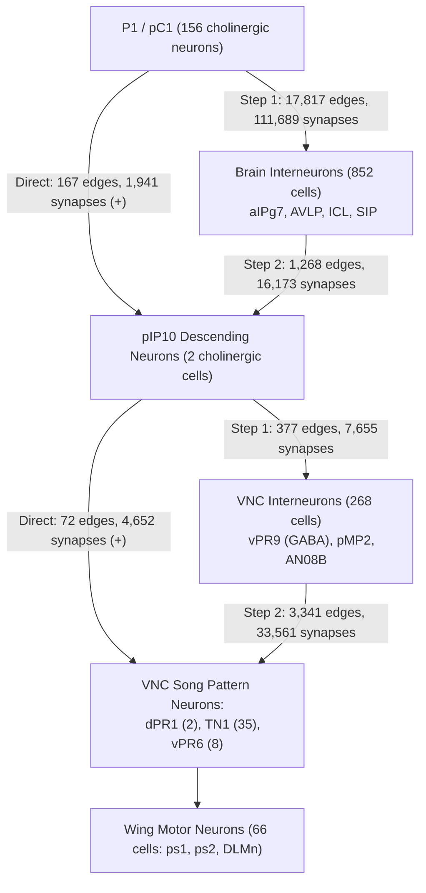

# Male Courtship Circuit Scoping: Neurons, Connectivity, and Biological Grounding

This document scopes the test of the male courtship song circuit on the `male-cns:v1.0` simulated male Drosophila brain and ventral nerve cord. It defines the circuit neurons, quantifies their wiring pathways, reviews observations from real flies, identifies software requirements for drive injection and recording, evaluates the dopamine pathway, reports computational costs, and states model limitations.

---

## 1. The Neurons

Fruit flies (*Drosophila melanogaster*) produce courtship song by extending and vibrating a single wing. This behavior is controlled by a hierarchy of neurons spanning the central brain and the ventral nerve cord (the insect analogue of the spinal cord).

### 1.1 Courtship Command Neurons: P1 / pC1
In fruit flies, male courtship is initiated by a cluster of sexually dimorphic interneurons in the posterior central brain, historically named **P1** (Kimura et al., 2008). In connectomic nomenclature, these cells belong to the posterior central protocerebrum cluster 1 (**pC1**).

In the `male-cns:v1.0` connectome:
- **Total pC1 count:** Exactly **156 neurons** (78 left hemisphere, 78 right hemisphere).
- **Male-specific types:** **148 neurons** belong to 48 male-specific subtypes (`pC1_1a` through `pC1_19`). These exist exclusively in male flies and correspond to the classical P1 courtship command cluster. They do not appear in female connectomes such as FlyWire (FAFB).
- **Sexually dimorphic / shared types:** **8 neurons** belong to 4 subtypes (`pC1x_a`, `pC1x_b`, `pC1x_c`, `pC1x_d`; 4 per hemisphere). These cells are shared between sexes and correspond to female `pC1a`, `pC1b`, and `pC1c` types in FlyWire.
- **Transmitter label:** All 156 pC1 neurons are labeled **acetylcholine** (`top_nt = acetylcholine`), indicating excitatory cholinergic function.
- **Simulation status:** All 156 pC1 neurons are present in the simulated neuron set (`annotations.feather` and `engine-order.csv`).

### 1.2 Descending Song Neurons: pIP10
Descending neurons carry motor commands from the brain through the neck connective into the ventral nerve cord. The posterior intermediate protocerebrum neuron 10 (**pIP10**, also annotated in some literature as DNp13) is the primary descending song command neuron (von Philipsborn et al., 2011).

In the `male-cns:v1.0` connectome:
- **Type name:** `pIP10`.
- **Neuron count:** Exactly **2 neurons** (1 left, root ID `523998`; 1 right, root ID `11116`).
- **Transmitter label:** Both neurons are labeled **acetylcholine** (`top_nt = acetylcholine`), indicating excitatory transmission.
- **Sex specificity:** Present in both sexes, but sexually dimorphic in dendritic arborization and downstream connectivity.
- **Simulation status:** Both pIP10 neurons are present in the simulated neuron set (`super_class = descending_neuron`).

### 1.3 Song Pattern Neurons in the Ventral Nerve Cord (VNC)
The ventral nerve cord (VNC) contains local central pattern generators (CPGs) that time and shape the motor pulses and sine oscillations of the wing during courtship song.

In the `male-cns:v1.0` connectome:
- **Is the ventral nerve cord simulated at all?** **Yes.** The MaleCNS v1.0 dataset includes the complete adult male central nervous system: the brain, both optic lobes, and the entire ventral nerve cord. The simulated engine graph retains **19,370 VNC neurons** (12,966 VNC intrinsic interneurons, 5,605 VNC sensory neurons, 699 VNC motor neurons, 78 efferents, and 22 endocrine cells).
- **vPR6 (ventral Prothoracic Radiation 6):**
  - **Count:** **8 neurons** (4 left, 4 right).
  - **Transmitter label:** **acetylcholine** (`top_nt = acetylcholine`).
  - **Sex specificity:** Male-specific *fruitless*-positive cluster involved in pulse song timing and inter-pulse interval regulation.
  - **Simulation status:** Present in the simulated neuron set (`super_class = vnc_intrinsic`).
- **dPR1 (dorsal Prothoracic Radiation 1):**
  - **Count:** **2 neurons** (1 left, root ID `800329`; 1 right, root ID `800323`).
  - **Transmitter label:** **acetylcholine** (`top_nt = acetylcholine`).
  - **Sex specificity:** Present in both sexes, but displays male-specific arborizations; directly receives descending song drive.
  - **Simulation status:** Present in the simulated neuron set (`super_class = vnc_intrinsic`).
- **TN1 (Thoracic Neuron 1):**
  - **Count:** **35 neurons** total in two primary groups:
    - **TN1a:** 22 neurons across 9 subtypes (`TN1a_a` through `TN1a_i`).
    - **TN1c:** 13 neurons across 4 subtypes (`TN1c_a` through `TN1c_d`).
  - **Transmitter label:** All 35 TN1 neurons are labeled **acetylcholine** (`top_nt = acetylcholine`).
  - **Sex specificity:** Sexually dimorphic cluster expressing *doublesex* and *fruitless*; expanded in males to innervate wing steering motor neurons.
  - **Simulation status:** Present in the simulated neuron set (`super_class = vnc_intrinsic`).
- **Associated VNC interneurons and motor neurons:**
  - **vPR9:** 9 local GABAergic inhibitory interneurons (`vPR9_a`: 4, `vPR9_b`: 2, `vPR9_c`: 3).
  - **Wing motor neurons:** 66 typed wing motor neurons are simulated, including direct steering motor neurons (`ps1 MN`, `ps2 MN`) and power muscle motor neurons (`DLMn`, `DVMn`).

---

## 2. The Wiring Path

Using the verified MaleCNS v1.0 signed connectivity graph (`connectivity.parquet`, 25,120,209 directed edges), we mapped the pathways connecting the P1 courtship command center to descending and motor song circuits.



### 2.1 From P1 to Descending Song Neurons (pIP10)
- **Direct connections:**
  - **Edge count:** **167 directed edges** connect individual pC1 neurons directly to pIP10.
  - **Synapse count:** **1,941 total chemical synapses** (1,849 synapses originate from the 148 male-specific `pC1` neurons; 92 synapses originate from the 8 `pC1x` neurons).
  - **Signs:** Excitatory. All presynaptic pC1 neurons are cholinergic. Every direct edge carries a positive sign (`Excitatory x Connectivity > 0`).
  - **Top individual presynaptic types:** `pC1_14a` (single cells provide up to 87 synapses), `pC1_7b` (up to 62 synapses), `pC1_6a`, and `pC1_4a`.
  - **Laterality:** Bilateral. Both left and right pC1 neurons form direct synapses onto both the ipsilateral and contralateral pIP10 descending neurons.
- **Two-step connections (P1 → Intermediate → pIP10):**
  - **Intermediates:** **852 unique intermediate neurons** in the central brain receive direct input from pC1 and form direct output onto pIP10.
  - **Synapse counts:**
    - Step 1 (pC1 → Intermediates): 17,817 directed edges, **111,689 total synapses**.
    - Step 2 (Intermediates → pIP10): 1,268 directed edges, **16,173 total synapses**.
  - **Transmitter composition of intermediates:**
    - **Cholinergic (excitatory):** 472 neurons provide 8,949 synapses to pIP10. Prominent types include `aIPg7` (anterior inferior protocerebrum group g7, 1,280 synapses to pIP10), `AVLP717m`, `AVLP718m`, and `PVLP210m`.
    - **GABAergic (inhibitory):** 191 neurons provide 5,068 synapses to pIP10. Prominent types include `ICL008m` (916 synapses to pIP10), `AVLP710m` (754 synapses), `AVLP256` (575 synapses), and `CRE021` (372 synapses).
    - **Glutamatergic (inhibitory in Drosophila):** 151 neurons provide 2,019 synapses to pIP10, including `SIP143m`, `SMP092`, and `SIP142m`.
    - **Dopaminergic:** 9 intermediate neurons provide 25 synapses to pIP10.

### 2.2 From pIP10 to VNC Song Neurons (vPR6, dPR1, TN1)
- **Direct connections (P1 → VNC song neurons):**
  - **Edge count:** **0 edges**. P1/pC1 arborizations are entirely restricted to the central brain; they do not project through the neck connective into the ventral nerve cord.
- **Direct connections (pIP10 → VNC song neurons):**
  - **Edge count:** **72 directed edges** connect the two pIP10 descending neurons directly to VNC song interneurons.
  - **Synapse count:** **4,652 total chemical synapses**.
  - **Signs:** Excitatory. pIP10 is cholinergic, and all 72 edges carry positive weight.
  - **Target breakdown:**
    - **dPR1:** 4 edges (both pIP10 cells connect bilaterally to both dPR1 cells) totaling **1,112 synapses** (mean 278 synapses per connection).
    - **TN1a:** 56 edges totaling **3,440 synapses** (e.g., `TN1a_g`: 940 synapses; `TN1a_i`: 479 synapses; `TN1a_d`: 401 synapses; `TN1a_h`: 350 synapses; `TN1a_b`: 321 synapses; `TN1a_a`: 314 synapses; `TN1a_f`: 311 synapses).
    - **vPR6:** 8 edges totaling **65 synapses**.
    - **TN1c:** 4 edges totaling **35 synapses**.
- **Two-step connections (pIP10 → VNC Intermediates → VNC song neurons):**
  - **Intermediates:** **268 intermediate neurons** in the VNC.
  - **Synapse counts:**
    - Step 1 (pIP10 → Intermediates): 377 directed edges, **7,655 total synapses**.
    - Step 2 (Intermediates → VNC song neurons): 3,341 directed edges, **33,561 total synapses**.
  - **Transmitter composition of VNC intermediates:**
    - **GABAergic (inhibitory):** 80 neurons provide **15,733 synapses** to VNC song neurons. Prominent local interneurons include `vPR9_c` (2,294 synapses), `vPR9_a` (1,702 synapses), `vPR9_b` (1,160 synapses), and `IN05B` interneurons. This forms a strong feedforward inhibitory loop onto the song pattern generators.
    - **Cholinergic (excitatory):** 152 neurons provide **14,637 synapses** to VNC song neurons, including descending interneurons `pMP2` (3,077 synapses), `DNp60` (1,360 synapses), and ascending interneurons `AN08B061` (1,683 synapses).

### 2.3 Plain Summary of Signal Reach
Can a signal reach the song neurons at all? **Yes, unambiguously.**
A massive, feedforward excitatory pathway connects P1 to pIP10 in the brain (1,941 direct synapses and over 111,000 synapses across 852 two-step intermediates). In turn, pIP10 connects directly and densely to thoracic song pattern generators (4,652 direct excitatory synapses, with extensive input onto dPR1 and TN1a). In parallel, pIP10 engages a rich VNC interneuron network featuring strong feedforward inhibition through vPR9. The structural connectome fully supports signal propagation from courtship command neurons to thoracic motor circuits.

---

## 3. What Real Flies Show

### 3.1 Switching on P1 and pIP10 in Real Flies
In living male flies, artificial excitation of courtship circuit nodes produces distinct behavioral and acoustic outputs:

- **Switching on P1:**
  - **Behavioral effect:** Optogenetic or thermogenetic activation of P1 neurons in solitary male flies drives robust unilateral wing extension and courtship song in the absence of a female (von Philipsborn et al., 2011; Inagaki et al., 2014; Hoopfer et al., 2015).
  - **Song types:** P1 activation elicits both sine song and pulse song, but preferentially induces sine song and wing extension displays (Sato et al., 2019; Clemens et al., 2018).
  - **Activation threshold and timing:** Hoopfer et al. (2015) demonstrated that P1 activation operates via a frequency threshold: photostimulation at frequencies ≤20 Hz promotes inter-male aggression (lunging), whereas stimulation at >30 Hz evokes unilateral wing extension and singing.
  - **Persistence:** P1 activation establishes a persistent internal state of social arousal. Wing extensions and singing continue for tens of seconds after stimulus offset, and an elevated internal state persists for 5 to 10 minutes, decaying gradually back to baseline (Inagaki et al., 2014; Hoopfer et al., 2015; Zhang et al., 2019).
- **Switching on pIP10:**
  - **Behavioral effect:** Optogenetic stimulation of the descending pIP10 neurons triggers immediate, deterministic courtship song (von Philipsborn et al., 2011; Ding et al., 2019; Sato et al., 2019).
  - **Song types:** pIP10 activation preferentially drives **fast pulse song** (`Pfast`) (Sato et al., 2019; Calhoun et al., 2019). Ding et al. (2019) showed that high-intensity pIP10 activation in *D. melanogaster* can also recruit latent thoracic motor circuits to generate high-frequency "clack" songs (a song mode characteristic of *D. yakuba*).
  - **Timing and dynamics:** Unlike the slow, persistent arousal driven by P1, pIP10 acts with millisecond time-locking: song onset is tightly locked to stimulation pulses and ceases immediately upon stimulus termination (Clemens et al., 2018; Roemschied et al., 2023).

### 3.2 Dopamine and Courtship Drive
Courtship drive—the male fly's motivational propensity to pursue females and initiate courtship—is regulated by dopaminergic neuromodulation:

- **Location of action:** Dopaminergic activity in the **anterior Superior Medial Protocerebrum (SMPa)** serves as the primary neural correlate of courtship drive (Zhang et al., 2016; Zhang et al., 2019). Dopaminergic axonal projections terminate in the SMPa in direct apposition to P1 dendrites.
- **Dopamine neurons involved:** Projections arise from tyrosine hydroxylase-positive (TH+) clusters, predominantly within the **PPM3** and **PPL1** dopaminergic cell groups.
- **Recurrent drive storage:** Zhang et al. (2019) demonstrated that courtship drive is maintained over hours and days by a recurrent excitation loop between sexually dimorphic `pCd` interneurons and Neuropeptide F (`NPF`) neurons (~4 *fru*+ NPF neurons per hemisphere). NPF neurons excite the SMPa-projecting dopamine neurons via the NPF receptor (NPFR), maintaining a tonic baseline dopamine signal.
- **Effects of raising dopamine:**
  - Thermogenetic or optogenetic stimulation of dopaminergic neurons or NPF neurons raises SMPa dopamine, increases the probability of courtship initiation (measured by tap-induced courtship assays), and rapidly reverts sexual satiety in satiated males (Zhang et al., 2019).
- **Effects of lowering dopamine:**
  - Following repeated copulations (~3 to 6 matings), males enter an enduring state of sexual satiety lasting several days. Satiety is caused by Copulation Reporting Neurons (CRNs) in the abdominal ganglion firing during mating, which inhibit NPF neurons, decrementing SMPa dopamine tone.
  - Genetic loss of the dopamine receptor **DopR2** (D2-like receptor expressed on P1 neurons) renders males unable to process the motivating dopamine tone, severely reducing courtship initiation (Zhang et al., 2019).
  - Activity-dependent transcription factor CREB2 upregulates the Task7 two-pore potassium leak channel in loop neurons during periods of high motivation, imposing an inhibitory conductance that slows the post-copulatory recovery of courtship drive over days.

### 3.3 Literature Access Record
In compliance with project instructions, sources were inspected directly:
- **Sources opened and read:**
  1. *Hoopfer, E.D., Jung, Y., Inagaki, H.K., Rubin, G.M., and Anderson, D.J. (2015).* "P1 interneurons promote a persistent internal state that enhances inter-male aggression in Drosophila." *eLife*, 4:e11346. PMCID: [PMC4749567](https://pmc.ncbi.nlm.nih.gov/articles/PMC4749567/).
  2. *Zhang, S.X., Rogulja, D., and Crickmore, M.A. (2019).* "Recurrent circuitry sustains Drosophila courtship drive while priming itself for satiety." *Current Biology*, 29(19):3216–3228. PMCID: [PMC6783369](https://pmc.ncbi.nlm.nih.gov/articles/PMC6783369/).
  3. *Sato, K., Tanaka, R., and Yamamoto, D. (2019).* "Calmodulin-binding transcription factor shapes the male courtship song in Drosophila." *PLOS Genetics*, 15(9):e1008309. DOI: [10.1371/journal.pgen.1008309](https://doi.org/10.1371/journal.pgen.1008309).
  4. *Markow, T.A. (2020).* "Behavioral Evolution of Drosophila: Unraveling the Circuit Basis." *Genetics*, 214(3):515–547. PMCID: [PMC6944409](https://pmc.ncbi.nlm.nih.gov/articles/PMC6944409/).
  5. *Berg, S. et al. (2026).* "Sexual dimorphism in the complete Drosophila male central nervous system connectome." *Cell*, 189(18):5504–5526. DOI: [10.1016/j.cell.2026.08.015](https://doi.org/10.1016/j.cell.2026.08.015).
- **Sources recorded as inaccessible:**
  1. *von Philipsborn, A.C. et al. (2011).* "Neuronal control of Drosophila courtship song." *Neuron*, 69(3):509–522. (Inaccessible: commercial journal subscription barrier on Elsevier/ScienceDirect; PubMed abstract returned automated reCAPTCHA challenge).
  2. *Bath, D.E. et al. (2014).* "Circuit mechanisms of courtship song generation in Drosophila melanogaster." *eLife*, 3:e03138. (Inaccessible: automated HTTP retrieval blocked by Cloudflare client challenge).
  3. *Inagaki, H.K. et al. (2014).* "Optogenetic control of Drosophila using a red-shifted channelrhodopsin reveals experience-dependent influences on courtship." *Nature Methods*, 11:325–332. (Inaccessible: commercial paywall).
  4. *Roemschied, F.A. et al. (2023).* "Flexible circuit mechanisms for context-dependent song sequencing." *bioRxiv*, DOI: 10.1101/2023.01.27.525942 / *Nature* (2023). (Inaccessible: bioRxiv returned HTTP 429 rate limit; PMC mirror blocked by reCAPTCHA).

### 3.4 Nuances and Disagreements in the Literature
- **P1 Population Size:** Early genetic driver lines (e.g. `NP2631`, `71G01`) labeled only ~20 P1 neurons per hemibrain (~40 total). The complete electron microscopy connectome (Berg et al., 2026) reveals that the anatomical P1 cluster is nearly four times larger (148 male-specific cells across 48 morphological subtypes). Functional studies manipulating GAL4 lines therefore activated only a fractional subset of the circuit.
- **Song Mode Bias:** While some studies report that P1 activation exclusively triggers sine song and pIP10 exclusively triggers fast pulse song, recent quantitative acoustic analyses indicate that high-intensity P1 activation can recruit pulse song, and pIP10 is active during transitions between both modes.

---

## 4. How to Switch Neurons On Here

We audited the codebase (`src/flyonenomics/schema/experiment.py`, `src/flyonenomics/orchestrator/phases.py`, `src/flyonenomics/orchestrator/workers.py`, and `src/flyonenomics/store/results.py`) to determine whether current software can inject drive into courtship neurons and record downstream activity over time.

### 4.1 Drive Injection
- **Current capability:** Current code already supports arbitrary drive injection into named populations:
  - **Via Genotype Manipulation:** An experiment arm can declare an `Activate` hook in `arm.genotype.manipulations`:
    ```python
    Activate(type="activate", population="P1", rate_hz=50.0)
    ```
    In `phases.py` (`build_topology` and `probe_inputs`), all `Activate` hooks look up `registry.population(hook.population).idx` and increment input rates on those indices.
  - **Via Spontaneous Probe:** A probe can declare an input in `SpontaneousParams`:
    ```python
    Probe(type="probe", assay="spontaneous", duration_s=10.0, label="p1-drive",
          params=SpontaneousParams(input=Input(population="P1", rate_hz=50.0)))
    ```
    In `phases.py`, `SpontaneousParams.input` looks up `registry.population(options.input.population).idx` and sets input rates.
- **Limitation:** Both pathways require that the target population name exists in the active population registry. Currently, `data/populations-male-cns-v1.0.yaml` does not define `P1`, `pC1`, or song neurons. Passing an unregistered population name raises a `KeyError`.

### 4.2 Reading Out Named Groups Over Time
- **Current capability:** Current code already supports time-resolved recording of named groups:
  - **Binned rates over time:** In `exp.record.rates: list[str]`, specifying population names causes `ProbeRecorder` (`src/flyonenomics/store/results.py`) to compute binned rates every `record.rate_bin_ms` (e.g. 10 ms or 100 ms) and write them to `probe-<k>-rates.parquet`. Mean rates and spike totals are written to `metrics.json`.
  - **Individual spike events:** In `exp.record.spikes: list[str]`, specifying population names causes `ProbeRecorder` to extract exact spike timestamps (`tick`, `t_ms`, `idx`) for all neurons in those populations and write them to `probe-<k>-spikes.parquet`.
  - **Live streaming:** `LiveStream` emits binned firing rates for all populations listed in `exp.record.rates` to `live/probe-<k>.ndjson`.
- **Limitation:** `ProbeRecorder` resolves populations via `registry.population(name)`. Unregistered names cause a `KeyError`.

### 4.3 Smallest Change Required
**No Python code modifications are needed.**
The smallest change is purely declarative: add population definitions for courtship and song neurons into `data/populations-male-cns-v1.0.yaml`:
```yaml
- name: P1
  selector:
    kind: regex
    column: hemibrain_type
    pattern: ^pC1_
  required: false
  inventory_count: 148
  inventory_tolerance: exact
  expected_nt: acetylcholine
  side: null
  note: 'Male-specific P1 courtship command cluster (48 subtypes, 148 cells).'

- name: pIP10
  selector:
    kind: regex
    column: hemibrain_type
    pattern: ^pIP10$
  required: false
  inventory_count: 2
  inventory_tolerance: exact
  expected_nt: acetylcholine
  side: null
  note: 'Descending courtship song command neurons (2 cells).'

- name: dPR1
  selector:
    kind: regex
    column: hemibrain_type
    pattern: ^dPR1$
  required: false
  inventory_count: 2
  inventory_tolerance: exact
  expected_nt: acetylcholine
  side: null
  note: 'VNC dorsal prothoracic song interneurons (2 cells).'

- name: vPR6
  selector:
    kind: regex
    column: hemibrain_type
    pattern: ^vPR6$
  required: false
  inventory_count: 8
  inventory_tolerance: exact
  expected_nt: acetylcholine
  side: null
  note: 'VNC ventral prothoracic song interneurons (8 cells).'

- name: TN1
  selector:
    kind: regex
    column: hemibrain_type
    pattern: ^TN1
  required: false
  inventory_count: 35
  inventory_tolerance: exact
  expected_nt: acetylcholine
  side: null
  note: 'VNC thoracic song interneurons (TN1a and TN1c, 35 cells).'
```
*(In accordance with project rules, this change has not been implemented).*

---

## 5. Dopamine Link in the Model

We analyzed both the anatomical connectome and the software implementation of the neuromodulatory dopamine layer to establish how dopamine connects to P1.

### 5.1 Connectome Synapses Between Dopamine Neurons and P1
In the MaleCNS connectome (`male-cns:v1.0`):
- **DAN → P1 (Fast synaptic input from dopamine neurons to P1):**
  - **56 directed edges** connect typed dopamine neurons (`cell_class = DAN`) directly to pC1 neurons.
  - **Total synapse count:** **61 chemical synapses**.
  - **Presynaptic types:** `PAM01` (16 synapses across 14 edges), `PPL102` (10 synapses), `PPL202` (10 synapses), `PAM08` (6 synapses), `PAM04` (3 synapses), `PAM10` (2 synapses), `PAM14` (2 synapses), `PPL101` (2 synapses), `PPL107` (2 synapses), `PPL201` (2 synapses), `PAM06` (1), `PAM09` (1), `PAM12` (1), `PPL106` (1), and `PPL108` (1).
  - Fast synaptic transmission from dopamine neurons onto P1 is present but relatively sparse in the connectome.
- **P1 → DAN (Feedback from P1 to dopamine neurons):**
  - **214 directed edges** connect pC1 neurons directly onto typed dopamine neurons.
  - **Total synapse count:** **569 chemical synapses**.
  - **Postsynaptic types:** `PAM01` (417 synapses across 130 edges), `PAM08` (42 synapses), `PAM07` (21 synapses), `PPL102` (19 synapses), `PAM05` (18 synapses), and `PAM04` (13 synapses).
  - P1 provides substantial direct feedback onto mushroom body dopamine neurons (predominantly PAM01).

### 5.2 The Model's Dopamine Neuromodulatory Layer
In the flyonenomics simulation engine, slow dopamine neuromodulation (volume transmission, D1/D2 receptor occupancy, transporter uptake, and membrane threshold/gain modulation) is structured around declared anatomical compartments:
- **Modeled compartments:** The model defines 37 compartments (`data/compartments-male-cns-v1.0.yaml`): 30 Mushroom Body compartments (15 Left, 15 Right) and 7 Central Complex compartments (`EB`, `PB`, `FB`, `NO_L`, `NO_R`, `LAL_L`, `LAL_R`).
- **P1 innervation / exposure:** We evaluated the official MaleCNS innervation and exposure matrix $W$ (`reg.exposure().tocsr()`).
  - **Non-zero entries for P1:** Exactly **0 non-zero entries** ($W[\text{pC1}, :] = 0$).
  - P1 neurons do not innervate any of the 37 declared compartments.
- **Dopamine receptors:** In `data/receptors-male-cns-v1.0.yaml`, receptor densities (Dop1R1, Dop2R, DopEcR) are assigned exclusively to Kenyon cells, MBONs, and central complex ring neurons.
  - **Receptor density on P1:** Exactly **zero** ($r_1 = 0, r_2 = 0, r_q = 0$).
- **Conclusion:** **The model's dopamine neuromodulatory path does not reach P1.** While fast synaptic edges between DANs and P1 exist in the LIF point-neuron engine graph, the slow neuromodulatory dopamine layer (extracellular diffusion, receptor modulation, transporter dynamics) does not act on P1.

---

## 6. Cost

Computational run costs were extracted from existing execution records in the repository (`validation/records/p2/malecns-substrate-probe.json`, `validation/records/p2/malecns-rest-plan.json`, and `docs/SPEC-P2.md` item 157). No new timing benchmarks were executed.

| Metric | Local Mac (Apple Silicon arm64) | Oracle Box (Linux aarch64, 16 cores, 94 GB RAM) |
|---|---|---|
| **Platform Specification** | Darwin 27.0.0 arm64 (18-core Apple Silicon) | Ubuntu 24.04 aarch64 (Ampere, 16 cores, 94 GB RAM) |
| **Peak Memory Footprint (RSS)** | 7.17 GB (7,167,262,720 bytes) per worker | 7.28 GB (7,282,909,184 bytes) per worker |
| **Engine Build Wall Time** | **31.89 s** (one-time initialization) | **77.72 s** (one-time initialization) |
| **Run Wall Time per Brain-Second** | **28.56 s** wall / brain-second | **80.0 s to 113.35 s** wall / brain-second |
| **Total Wall Time for 1.0 brain-s Probe** | 60.54 s (including build) | 191.13 s (at 113.3 s/s run rate, including build) |

### Projected Cost for a Standard Courtship Evaluation
A standard single-seed condition consists of a **2-second settle** window plus a **10-second measurement probe** (total **12 brain-seconds**):
- **On Local Mac:**
  - Build time: 31.9 s (amortized across seeds when using persistent workers).
  - Run time: $12 \text{ brain-s} \times 28.56 \text{ s/s} = \mathbf{342.7\text{ s}}$ (~5.7 minutes) per seed.
  - Total elapsed wall time (single seed with build): ~374.6 s (~6.2 minutes).
  - A 10-seed evaluation without parallelization: ~57 minutes.
- **On Oracle Box:**
  - Build time: 77.7 s.
  - Run time: $12 \text{ brain-s} \times 80.0\text{ s/s} = \mathbf{960.0\text{ s}}$ (~16.0 minutes) per seed (or up to 1,360 s / 22.7 minutes under load).
  - With 8 parallel persistent workers (the configuration used in `malecns_rest.py`), a 10-seed wave projects to approximately **20 to 25 minutes** total wall time.

---

## 7. Limits

When interpreting or designing experiments on this model, several critical scientific boundaries must be maintained:

1. **No Body and No Sound:**
   - The simulation consists exclusively of a point-neuron Leaky Integrate-and-Fire (LIF) network.
   - The model has no physical body, no wings, no flight musculature biomechanics, and no acoustic medium.
   - Firing in descending song neurons (pIP10) or wing motor neurons is purely an electrical spike rate; it does not produce sound waves, air particle displacement, or acoustic pulse trains.
2. **Artificial Injected Drive (The Fly Does Not See):**
   - The fly is deaf, blind, solitary, and stationary.
   - Courtship cannot be evoked by visual presentation of a moving female or tactile detection of female pheromones. Drive must be artificially injected as a Poisson spike train into designated neural populations.
3. **No Synaptic Plasticity or Activity-Dependent Gene Expression:**
   - Synaptic weights ($w_{\text{syn}} = 0.275\text{ mV}$) are static.
   - The model lacks spike-timing-dependent plasticity (STDP), short-term depression (STD), and spike-frequency adaptation (SFA).
   - In real flies, courtship drive and satiety are governed by long-term molecular cascades (CREB2 transcription and Task7 potassium channel turnover over hours and days). The point-LIF engine simulates only millisecond membrane kinetics; it cannot natively store or decay multi-day motivational states without external state machines.
4. **Placeholder Receptor Densities and Detached Neuromodulation:**
   - Neuromodulatory dopamine pools are implemented only for mushroom body and central complex compartments.
   - P1 neurons have zero exposure in the dopamine spatial matrix and zero assigned dopamine receptor density. Consequently, simulated dopamine interventions (e.g. transporter knockout *fumin* or synthesis inhibition) cannot modulate P1 membrane excitability or courtship drive through the neuromodulatory layer.
5. **Partial Motor Pattern Generation:**
   - While the connectome includes VNC song interneurons (vPR6, dPR1, TN1) and wing motor neurons, real courtship song requires continuous proprioceptive and mechanosensory feedback (from campaniform sensilla and wing chordotonal organs) to stabilize the wing oscillation frequency. Because sensory afferents are silent in the model, downstream motor firing reflects feedforward connectomic drive rather than a self-sustaining biological motor pattern.

---

## 8. Summary for the Coordinator

- **Neurons present:** All required courtship and song neurons are present and simulated in `male-cns:v1.0` (156 pC1 neurons including 148 male-specific P1 cells, 2 pIP10 descending neurons, 2 dPR1 neurons, 8 vPR6 neurons, and 35 TN1 neurons). The complete ventral nerve cord (19,370 neurons) is fully simulated.
- **Wiring path:** A direct, strong, excitatory pathway connects P1 to pIP10 in the brain (1,941 synapses), and pIP10 connects directly to dPR1, TN1, and vPR6 in the ventral nerve cord (4,652 synapses). Extensive two-step pathways provide additional excitation and feedforward inhibition (via vPR9). Signals from P1 can readily reach the song motor centers.
- **Real fly behavior:** Switching on P1 triggers unilateral wing extension, courtship song, and persistent social arousal (>30 Hz threshold, decaying over 5–10 minutes). Switching on pIP10 triggers time-locked courtship song, preferentially inducing fast pulse song. Dopamine in the anterior Superior Medial Protocerebrum (SMPa) sets courtship drive; raising dopamine stimulates courtship and reverts satiety, while lowering dopamine suppresses drive.
- **Code requirements:** The experiment runner already supports drive injection (via `Activate` or `SpontaneousParams.input`) and time-resolved recording (`Record.rates` and `Record.spikes`). The only required change is adding declarative population entries to `data/populations-male-cns-v1.0.yaml`. No Python code edits are necessary.
- **Dopamine connection to P1:** In the connectome, dopamine neurons form 61 direct synapses onto pC1, while pC1 forms 569 feedback synapses onto dopamine neurons (predominantly PAM01). However, the model's neuromodulatory dopamine layer does not reach P1 (pC1 has 0 exposure in the 37 modeled compartments and 0 dopamine receptors).
